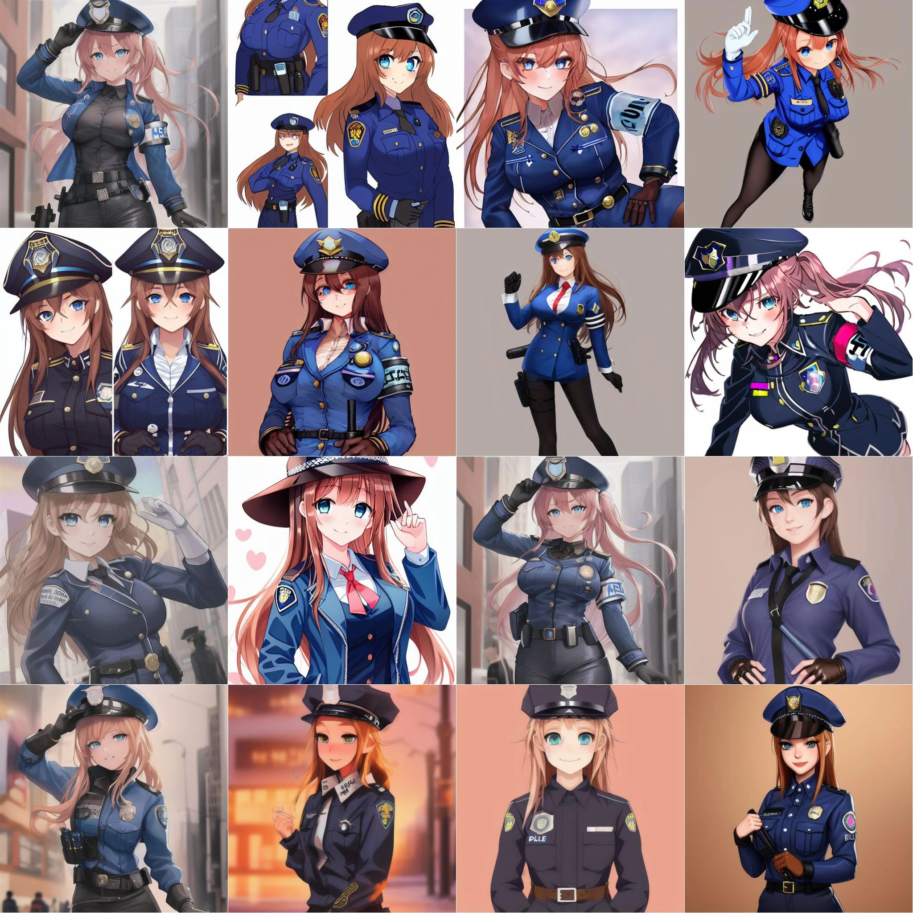

<!-- Improved compatibility of back to top link: See: https://github.com/Killua7362/animefusion/pull/73 -->
<a name="readme-top"></a>
<!--
*** Thanks for checking out the Best-README-Template. If you have a suggestion
*** that would make this better, please fork the repo and create a pull request
*** or simply open an issue with the tag "enhancement".
*** Don't forget to give the project a star!
*** Thanks again! Now go create something AMAZING! :D
-->


<!-- PROJECT SHIELDS -->
<!--
*** I'm using markdown "reference style" links for readability.
*** Reference links are enclosed in brackets [ ] instead of parentheses ( ).
*** See the bottom of this document for the declaration of the reference variables
*** for contributors-url, forks-url, etc. This is an optional, concise syntax you may use.
*** https://www.markdownguide.org/basic-syntax/#reference-style-links
-->
[![Contributors][contributors-shield]][contributors-url]
[![Forks][forks-shield]][forks-url]
[![Stargazers][stars-shield]][stars-url]
[![Issues][issues-shield]][issues-url]
[![MIT License][license-shield]][license-url]
[![LinkedIn][linkedin-shield]][linkedin-url]


<!-- PROJECT LOGO -->
<br />
<div align="center">
  <a href="https://github.com/Killua7362/animefusion">
    
  </a>

  <h3 align="center">AnimeFusion</h3>

  <p align="center">
    Stable diffusion implementation with transformers!<br>
    <a href="https://github.com/Killua7362/animefusion/issues">Report Bug</a>
    ·
    <a href="https://github.com/Killua7362/animefusion/issues">Request Feature</a>
  </p>
</div>


<!-- TABLE OF CONTENTS -->
<details>
  <summary>Table of Contents</summary>
  <ol>
    <li>
      <a href="#about-the-project">About The Project</a>
    </li>
    <li>        
    <a href="#built-with">Built With</a>
    </li>
    <li>
      <a href="#getting-started">Getting Started</a>
    </li>
      <li>
      <a href="#results">Results</a>
    </li>
    <li><a href="#roadmap">Roadmap</a></li>
        <li><a href="#credits">Credits</a></li>

  </ol>
</details>


<!-- ABOUT THE PROJECT -->
## About The Project
Stable diffusion is a vital concept in the realm of generative models, serving as a technique to enhance the quality and diversity of generated data. It addresses key challenges associated with traditional generative models, such as mode collapse and limited variability in generated samples. At its core, stable diffusion involves a controlled process of transitioning data from an initial state to a final state while incrementally introducing noise at each step. This controlled noise injection allows generative models to explore a broader spectrum of data variations, resulting in more realistic and diverse output.

### Built With

* [Python](https://www.python.org/)
*  [Pytorch](https://pytorch.org/)
* [transformers](https://huggingface.co/docs/transformers/index)
* [diffusers](https://huggingface.co/docs/diffusers/index)
* [numpy](https://numpy.org/)


<!-- GETTING STARTED -->
## Getting Started

Install all the libraries
  ```sh
  pip install pytorch torchvision transformers diffusers numpy albumentations
  ```

Change the arguments value like dataset,batch size,etc in `trainer.py` file and call any function `train` or `test` at the end of the file and run `trainer.py`

<!-- Results -->
## Results



<!-- ROADMAP -->
## Roadmap
- [x] Implementing stable diffusion with Unet,VAE and clip model
- [x] Writing both test and train function
- [x] Training on Anime dataset 
- [ ] Trying different hyperparameters

See the [open issues](https://github.com/Killua7362/animefusion/issues) for a full list of proposed features (and known issues).


<!-- Credits -->
## Credits
- https://www.kaggle.com/datasets/shanmukh05/anime-names-and-image-generation
- https://arxiv.org/abs/2302.05543


<!-- MARKDOWN LINKS & IMAGES -->
<!-- https://www.markdownguide.org/basic-syntax/#reference-style-links -->
[contributors-shield]: https://img.shields.io/github/contributors/Killua7362/animefusion.svg?style=for-the-badge
[contributors-url]: https://github.com/Killua7362/animefusion/graphs/contributors
[forks-shield]: https://img.shields.io/github/forks/Killua7362/animefusion.svg?style=for-the-badge
[forks-url]: https://github.com/Killua7362/animefusion/network/members
[stars-shield]: https://img.shields.io/github/stars/Killua7362/animefusion.svg?style=for-the-badge
[stars-url]: https://github.com/Killua7362/animefusion/stargazers
[issues-shield]: https://img.shields.io/github/issues/Killua7362/animefusion.svg?style=for-the-badge
[issues-url]: https://github.com/Killua7362/animefusion/issues
[license-shield]: https://img.shields.io/github/license/Killua7362/animefusion.svg?style=for-the-badge
[license-url]: https://github.com/Killua7362/animefusion/blob/master/LICENSE.txt
[linkedin-shield]: https://img.shields.io/badge/-LinkedIn-black.svg?style=for-the-badge&logo=linkedin&colorB=555
[linkedin-url]: https://linkedin.com/in/Killua7362
[product-screenshot]: images/screenshot.png
[Next.js]: https://img.shields.io/badge/next.js-000000?style=for-the-badge&logo=nextdotjs&logoColor=white
[Next-url]: https://nextjs.org/
[React.js]: https://img.shields.io/badge/React-20232A?style=for-the-badge&logo=react&logoColor=61DAFB
[React-url]: https://reactjs.org/
[Vue.js]: https://img.shields.io/badge/Vue.js-35495E?style=for-the-badge&logo=vuedotjs&logoColor=4FC08D
[Vue-url]: https://vuejs.org/
[Angular.io]: https://img.shields.io/badge/Angular-DD0031?style=for-the-badge&logo=angular&logoColor=white
[Angular-url]: https://angular.io/
[Svelte.dev]: https://img.shields.io/badge/Svelte-4A4A55?style=for-the-badge&logo=svelte&logoColor=FF3E00
[Svelte-url]: https://svelte.dev/
[Laravel.com]: https://img.shields.io/badge/Laravel-FF2D20?style=for-the-badge&logo=laravel&logoColor=white
[Laravel-url]: https://laravel.com
[Bootstrap.com]: https://img.shields.io/badge/Bootstrap-563D7C?style=for-the-badge&logo=bootstrap&logoColor=white
[Bootstrap-url]: https://getbootstrap.com
[JQuery.com]: https://img.shields.io/badge/jQuery-0769AD?style=for-the-badge&logo=jquery&logoColor=white
[JQuery-url]: https://jquery.com 
[Chakra.com]: https://raw.githubusercontent.com/chakra-ui/chakra-ui/main/media/logo-colored@2x.png?raw=true
[Chakra-url]: https://chakra-ui.com/
[Express-url]:https://expressjs.com/
[NodeJS-url]:https://nextjs.org/
[MDX-url]:https://mdxjs.com/
[next-mdx-url]:https://github.com/hashicorp/next-mdx-remote/